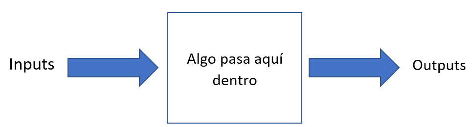

class: center, middle

.linea-superior[]
.linea-inferior[]


## Capacitación en R

## Funciones y estilo de código

### septiembre 2020

```{r setup, include=FALSE}
options(htmltools.dir.version = FALSE)
knitr::opts_chunk$set(message = FALSE) 
```

```{r xaringan-themer, include=FALSE, warning=FALSE}
library(xaringanthemer)
#style_duo_accent(
 # primary_color = "#1381B0",
  #secondary_color = "#FF961C",
  #inverse_header_color = "#FFFFFF"
#)
```


---

background-image: url("imagenes/fondo2.PNG")
background-size: contain;
background-position: 100% 0%

# Contenidos de hoy

--

- ¿Qué es una función?

--

- ¿Por qué son importantes las funciones?

--

- Implementación en R

--

- Mi primera función

---

background-image: url("imagenes/fondo2.PNG")
background-size: contain;
background-position: 100% 0%


# ¿Qué es una función?

### Nosotros ya hemos visto muchas funciones durante las clases

--

- `mean()`

- `sum()`

- `c()`

- `summary()`

--

.center[
### Ya deberíamos tener una intuición
]

--

.center[

]

---

background-image: url("imagenes/fondo2.PNG")
background-size: contain;
background-position: 100% 0%

# ¿Por qué usar funciones?

## Volvamos a la solución de la última tarea

```{r, eval=FALSE}
options(scipen = "999") #para eliminar notación científica
#Abrir base de la epf
epf <- read.delim("data/base-personas-viii-epf-(formato-csv).csv", sep = ";" )
names(epf) <- tolower(names(epf)) #pasar a minúscula

#Reemplazar las comas por punto
epf2 <- epf %>% 
  select(gastot_hd_pc, ing_disp_hog_hd_pc, zona =  ï..zona, jhogar, sexo) %>% 
  mutate_at(vars(gastot_hd_pc, ing_disp_hog_hd_pc), funs(as.numeric(gsub(pattern = ",", replacement = ".", x = .)) )) %>% 
  filter(jhogar == 1) #dejar un registro por hogar

#Calcular los puntos de corte para los quintiles  
quintiles <- quantile(x = epf2$ing_disp_hog_hd_pc, c(0, 0.2, 0.4, 0.6, 0.8, 1)) 

#Crear la variable quintil.
epf2 <- epf2 %>% 
  mutate(quintil =  case_when(
    ing_disp_hog_hd_pc <= quintiles[2] ~ "quntil1",
    ing_disp_hog_hd_pc <= quintiles[3] ~ "quntil2",
    ing_disp_hog_hd_pc <= quintiles[4] ~ "quntil3",
    ing_disp_hog_hd_pc <= quintiles[5] ~ "quntil4",
    ing_disp_hog_hd_pc <= quintiles[6] ~ "quntil5")
)


```

---
background-image: url("imagenes/fondo2.PNG")
background-size: contain;
background-position: 100% 0%

# ¿Por qué usar funciones?

## ¿Notan una repetición de código?

```{r, eval=F}
 

epf2 %>%
  group_by(quintil) %>% 
  summarise_at(vars(gastot_hd_pc, ing_disp_hog_hd_pc), funs(mean)) %>% 
  pivot_longer(-quintil, names_to = "tipo", values_to = "valor") %>% 
  ggplot(aes(quintil, valor, fill = tipo )) +
  geom_bar(stat = "identity", position = "dodge")

epf2 %>%
  group_by(zona) %>% 
  summarise_at(vars(gastot_hd_pc, ing_disp_hog_hd_pc), funs(mean)) %>% 
  pivot_longer(-zona, names_to = "tipo", values_to = "valor") %>% 
  ggplot(aes(as.factor(zona), valor, fill = tipo )) +
  geom_bar(stat = "identity", position = "dodge")


epf2 %>%
  group_by(sexo) %>% 
  summarise_at(vars(gastot_hd_pc, ing_disp_hog_hd_pc), funs(mean)) %>% 
  pivot_longer(-sexo, names_to = "tipo", values_to = "valor") %>% 
  ggplot(aes(as.factor(sexo), valor, fill = tipo )) +
  geom_bar(stat = "identity", position = "dodge")


```


---
background-image: url("imagenes/fondo2.PNG")
background-size: contain;
background-position: 100% 0%

# ¿Y si ordenamos esto de otra forma?

```{r, eval = F}
epf <- read.delim("data/base-personas-viii-epf-(formato-csv).csv", sep = ";" )

datos_editados <-  editar_datos(epf)

grafico1 <- generar_grafico(datos_editados, quintil)
grafico2 <- generar_grafico(datos_editados, zona)
grafico3 <- generar_grafico(datos_editados, sexo)

```


--
.center[
## Es más fácil de leer, ¿cierto?
]

--

Las funciones nos ayudan a abstrear tareas, permitiéndonos: 

- Reutilizar código

- Crear código más fácil de actualizar

- Crear código más fácil de leer para mí y para otros 

---

background-image: url("imagenes/fondo2.PNG")
background-size: contain;
background-position: 100% 0%

# Un ejemplo real del INE

## Cargas de asignación para codificación

```{r, eval=F }
#Seleccionar los registros a codificar
seleccion_cod <- seleccionar_codificacion(ciuo, batch[[codificador]])

#Asignar carga de codificación a una persona en específico  
carga_codificacion[[codificador]] <- aumentar_cargas(carga_codificacion[[codificador]], seleccion_cod)

#Disminuir registros asignados
asignados <- seleccion_cod %>% 
  pull(idrph)

ciuo <- ciuo %>% 
  filter(!idrph %in% asignados)

#Seleccionar reistros que serán revisados. Solo se revisa el 90% 
a_revisar <- seleccionar_revision(seleccion_cod)

#Dsitribuir entre todos las personas restantes los registros a revisar
asignacion_revision <-  distribuir_revision(a_revisar, codificadores, codificador)

```


---
background-image: url("imagenes/fondo2.PNG")
background-size: contain;
background-position: 100% 0%

# Implementación en R

```{r}

mi_funcion <- function(x, y) {
  suma <- x + y   
  return(suma)
}
```

--

```{r}
formals(mi_funcion)
```


--

```{r}
body(mi_funcion)
```

--

```{r}
environment(mi_funcion)
```


---
background-image: url("imagenes/fondo2.PNG")
background-size: contain;
background-position: 100% 0%

# Implementación en R


Partes de la función: 

- Parámetros (`formals`)

- Cuerpo de la función (`body`)

- Ambiente (`environment`)

--

## ¿Qué va a devolver esta llamada?

```{r, eval=F}
mi_funcion(1, 2)
```
--
```{r, echo=F}
mi_funcion(1, 2)
```

--

.red[¡atención!] El orden de los argumentos es importante .red[¡atención!]

--

`R` interpreta lo siguiente: `x = 1` e  `y = 2`

--

Si quieres ingresar los argumentos en otro orden, debes usar sus nombres 

```{r, eval=F}
mi_funcion(y = 2, x = 1)
```

--

Si no hay preguntas, vamos por el primer ejercicio

---
background-image: url("imagenes/fondo2.PNG")
background-size: contain;
background-position: 100% 0%

# Ejercicio rápido

Creemos una función llamada `resta_cuadrados` que retorne la resta de los cuadros de dos números. Luego, evalúa la función en los números 5 y 4 (en ese orden)

--

```{r}
resta_cuadrados <- function(x, y) {
  x**2 - y**2
}
resta_cuadrados(5, 4)
```
--

## ¿Notan algo diferente en el cuerpo de la función?

--

Las funciones en R devuelven siempre la última sentencia

El uso de `return` es opcional


---
background-image: url("imagenes/fondo2.PNG")
background-size: contain;
background-position: 100% 0%

# Ejercicio rápido 

Hagamos que nuestra función sea un poco más interesante. 

Agreguemos un argumento que reciba tu nombre en formato string. La función debe devolver el siguiente texto: *[nombre], el resultado es: [resultado]*    

--

```{r, echo=F}
resta_cuadrados <- function(x, y, nombre) {
  resultado <- x**2 - y**2
  texto <- paste0(nombre, ", el resultados es: ", resultado)
  return(texto)
}

resta_cuadrados(5, 4, "amigo")

```
--

```{r, eval=T}

resta_cuadrados <- function(x, y, nombre) {
  resultado <- x**2 - y**2
  texto <- paste0(nombre, ", el resultados es: ", resultado)
  return(texto)
}

resta_cuadrados(5, 4, "amigo")


```


---


background-image: url("imagenes/fondo2.PNG")
background-size: contain;
background-position: 100% 0%

# Argumentos ausentes 


```{r, error=T}
resta_cuadrados <- function(x, y, nombre) {
  resultado <- x**2 - y**2
  texto <- paste0(nombre, ", el resultados es: ", resultado)
  return(texto)
}

resta_cuadrados(5, "amigo")
```
--

## ¿Qué es lo que está pasando acá?

.center[

]


--

`R` está asumiento que el valor para el segundo argumento es "amigo"

En `R` el operador potencia no adimite el uso de un strings


---
background-image: url("imagenes/fondo2.PNG")
background-size: contain;
background-position: 100% 0%

# Argumentos ausentes 

## Agreguemos explícitamente los nombres de cada argumento

--

```{r, error=T}
resta_cuadrados <- function(x, y, nombre) {
  resultado <- x**2 - y**2
  texto <- paste0(nombre, ", el resultados es: ", resultado)
  return(texto)
}

resta_cuadrados(x = 5, nombre =  "amigo") #<<

```
--

.center[

]
 

--

R no encuentra la variable `y`, por lo que no puede computar la expresión

---
background-image: url("imagenes/fondo2.PNG")
background-size: contain;
background-position: 100% 0%

#Valores por defecto


```{r, error=T}
resta_cuadrados <- function(x, y = 4, nombre) {
  resultado <- x**2 - y**2
  texto <- paste0(nombre, ", el resultados es: ", resultado)
  return(texto)
}

resta_cuadrados(x = 5,  nombre =  "amigo")

```
--

Si el usuario no ingresa ningún valor, `y` valdrá 4

Esto es muy útil cuando se le quiere dar la posibilidad al usuario de que no ingrese todos los argumentos

---
background-image: url("imagenes/fondo2.PNG")
background-size: contain;
background-position: 100% 0%

#Scope de la función

## Queremos acceder al objeto resultado, creado dentro de la función

## ¿Qué creen que va a producir la línea destacada?


```{r, eval=F}
resta_cuadrados <- function(x, y, nombre) {
  resultado <- x**2 - y**2  #<<
  texto <- paste0(nombre, ", el resultados es: ", resultado)
  return(texto)
}

resta_cuadrados(x = 5, y = 4,  nombre =  "amigo")
print(resultado) #<<
```
--

```{r, error=T, echo = F}
print(resultado)
```
.center[

]

---
background-image: url("imagenes/fondo2.PNG")
background-size: contain;
background-position: 100% 0%

#Scope de la función

## Las variables creadas al interior de una función solo existen dentro de ella: viven dentro del scope de la función

--

## ¿Qué mostrará la función `print`?

```{r, results = "hide"}
resultado <- 999

resta_cuadrados <- function(x, y, nombre) {
  resultado <- x**2 - y**2 
  texto <- paste0(nombre, ", el resultados es: ", resultado)
  return(texto)
}
resta_cuadrados(x = 5, y = 4,  nombre =  "amigo")
print(resultado) #<<

```

--

```{r, echo=F}
print(resultado) 
```

Lo que ocurre dentro de la función no afecta lo de afuera

---

background-image: url("imagenes/fondo2.PNG")
background-size: contain;
background-position: 100% 0%

# Ejercicio ~~no tan~~ largo

Vamos a crear una función que recibe un vector y devuelve 3 cosas:

- la media

- el valor mínimo

- el valor máximo

Piensen por ejemplo en el vector `c(1, 50, 30, 23)`

**Pista 1**: Puedes echar mano las funciones `min`, `max` y `mean`  

**Pista 2**: Puedes usar la función `c()` para almacenar tus valores antes de devolverlos

```{r, eval=F}
vector <- c(1, 50, 30, 23)
resumen <- function() {
  #Aquí va tu código
}
#no olvides llamar a la función
```

---

background-image: url("imagenes/fondo2.PNG")
background-size: contain;
background-position: 100% 0%

# Respuesta ejercicio ~~no tan~~ largo

```{r}
vector <- c(1, 50, 30, 23)
resumen <- function(v) {
  resultados <- c(min = min(v), max = max(v), media = mean(v) ) 
  return(resultados)
}
resumen(vector)
```


---
.linea-superior[]
.linea-inferior[]

<br>
<br>

.center[

.texto_intermedio[
Vamos a pasar al segundo tema de esta clase
]

]
---

class: center, middle

.linea-superior[]
.linea-inferior[]


## Gracias
